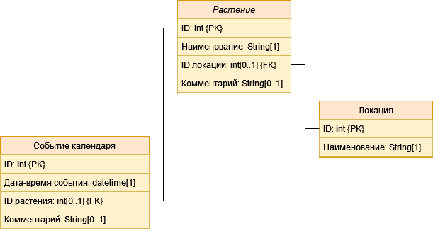
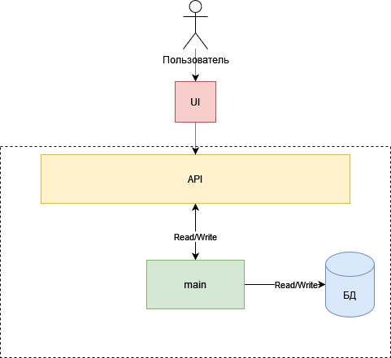
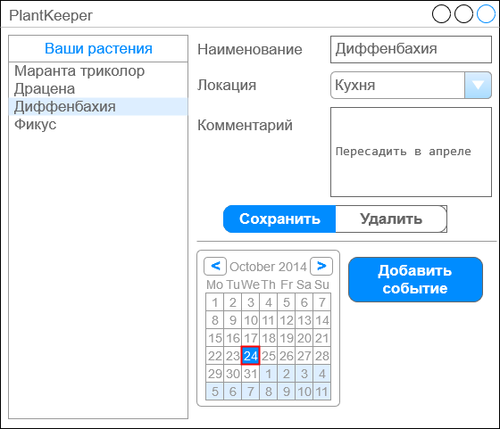

# PlantKeeper
Учебный проект курса [Otus](https://otus.ru) [Kotlin Backend Developer](https://otus.ru/lessons/kotlin/).
Поток курса 2022-12.

Приложение-помощник по уходу за домашними растениями.
Возможности:
* реестр домашних растений,
* рекоммендации и советы по уходу,
* индивидуальное расписание по поливу для каждого растения с возможностью напоминаний.

## Документация
### Маркетинг
1. [Заинтересанты](./docs/marketing/stakeholders.md)
2. [Целевая аудитория](./docs/marketing/target-audience.md)
3. [Конкурентный анализ](./docs/marketing/concurrency.md)

### MVP
MVP сервиса должна включать в себя следующие функциональные возможности:
- управление карточками растений
  - добавление
  - изменение
  - удаление
  - просмотр карточки
  - просмотр списка карточек
- управление расписанием о поливе растений. Событие может быть привязано к конкретному растению.
  - добавление 
  - изменение
  - удаление
  - просмотр события в календаре
  - просмотр списка событий
- напоминания пользователю о поливе
- управление локациями расположения растений
  - добавление
  - изменение
  - удаление
  - просмотр
  - просмотр списка

#### Сущности в MVP

Выделяются три сущности:
- Растение
- Событие календаря
- Локация

#### Архитектура

Стандартная схема сервиса с API и взаимодействием с БД

#### Прототип UI
